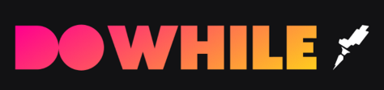
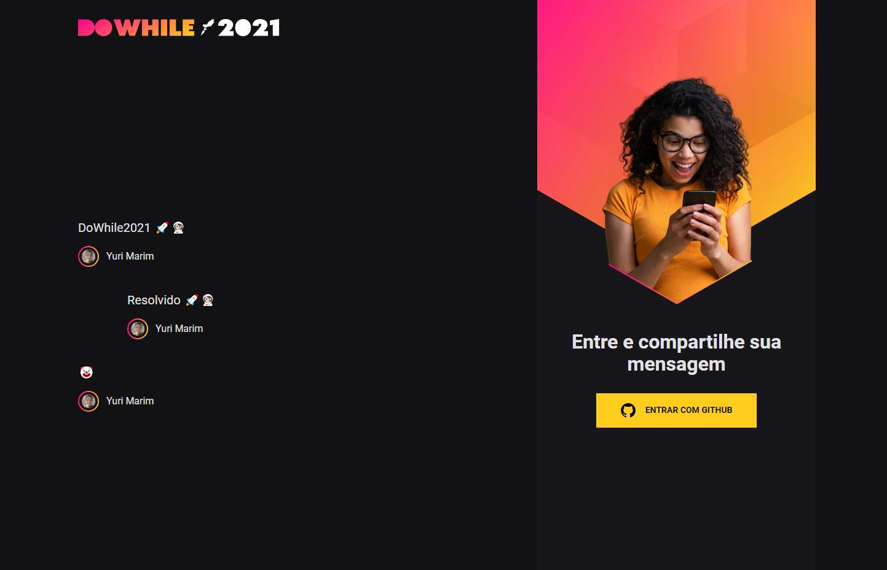

<p align="center">
   
</p>

<p align="center">
  
  
  
  <p align="center">
  <a href="#sobre">Sobre</a>&nbsp;&nbsp;&nbsp;|&nbsp;&nbsp;&nbsp;
  <a href="#tecnologias-utilizadas">Tecnologias utilizadas</a>&nbsp;&nbsp;&nbsp;|&nbsp;&nbsp;&nbsp;
  <a href="#licença-e-autor">Licença e Autor</a>
</p>

## Sobre

**DoWhile2021 -> Front-end Web (React.js).** trata-se de um projeto realizado durante um evento da Rocketseat - Next Level Week Heat: Trilha Impulse 🚀🔥

## Print

<p align="center">
   
</p>

## Rodar projeto

- Na pasta do projeto rodar:

```
yarn
```

- Para iniciar o servidor:

```
yarn dev
```

### Tecnologias utilizadas

- React.js
- Typescript
- Vite.js
- CSS Modules
- SASS
- React-icons
- Express
- Prisma
- Dotenv
- Axios
- Jsonwebtoken
- Socket.io
- Cors

## Licença e Autor

Este projeto está sob a licença MIT. Veja o arquivo [LICENSE](https://github.com/yurimarim/nlw-heat-impulse-web/blob/main/LICENSE.txt) para mais detalhes.

<p>


[](https://www.linkedin.com/in/yurimarim)
